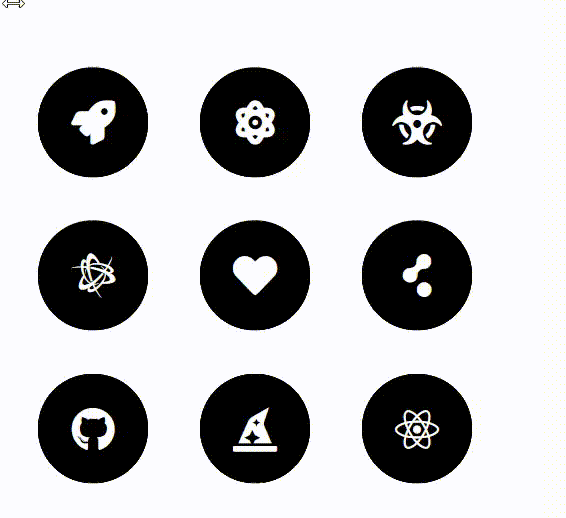

## 🚀 Como executar

- Clone o repositório
- Abra o arquivo index.html no navegador.

## 📄 Licença

Esse projeto está sob a licença MIT. Veja o arquivo [LICENSE](LICENSE.md) para mais detalhes.

---

Feito com 💜 by Rafael Angonese
